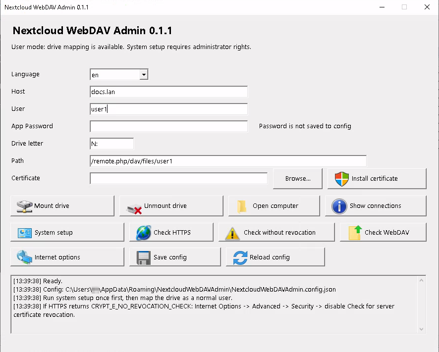

# Nextcloud WebDAV Admin

**Nextcloud WebDAV Admin** is a portable Windows GUI utility for mounting Nextcloud WebDAV as a Windows network drive.

Version: **0.1.1**



## Features

- mount Nextcloud WebDAV as a Windows drive;
- unmount the connected drive;
- show active network connections;
- open the mounted drive in Windows Explorer;
- check HTTPS;
- check HTTPS without certificate revocation verification;
- check WebDAV;
- install a local / self-signed CA certificate;
- run Windows WebClient/WebDAV system setup;
- portable mode without installer;
- Ukrainian and English UI.

## Important

The application uses Windows API `WNetAddConnection2` for WebDAV drive mapping.

The Nextcloud App Password is **not stored** in the configuration file.

## Configuration

Starting with version **0.1.1**, settings are stored in the current Windows user profile:

```text
%APPDATA%\NextcloudWebDAVAdmin\NextcloudWebDAVAdmin.config.json
```

Configuration lookup order:

1. user profile config;
2. config next to the program as fallback/template;
3. built-in defaults.

The config file next to the program remains only as a fallback template for first launch.

## Example config

```json
{
  "language": "uk",
  "host": "docs.lan",
  "userId": "user1",
  "drive": "N:",
  "davPath": "/remote.php/dav/files/user1",
  "certPath": "",
  "authForwardServer": "https://docs.lan",
  "persistent": true
}
```

## Usage

1. Unzip the archive to a permanent folder.
2. Run `Create-DesktopShortcut.vbs` to create a desktop shortcut.
3. Start **Nextcloud WebDAV Admin**.
4. Set host, user, drive letter, and WebDAV path.
5. Enter the Nextcloud **App Password**.
6. Click **Mount drive**.

## Certificate

For a local or self-signed CA certificate:

1. select a `.cer`, `.crt`, or `.pem` certificate file;
2. click **Install certificate**;
3. approve the administrator prompt.

The application runs:

```cmd
certutil -addstore -f Root "certificate_file"
```

## HTTPS and CRYPT_E_NO_REVOCATION_CHECK

In local networks with a private CA, Windows may return:

```text
CRYPT_E_NO_REVOCATION_CHECK
```

For this case, the application has a separate button:

```text
Check without revocation
```

You can also disable server certificate revocation checking in Windows:

```text
Internet Options -> Advanced -> Security
```

## Changes in 0.1.1

- settings are now stored in the Windows user profile;
- added fallback config next to the program;
- all config saves now go to `%APPDATA%`;
- manual mount logic from 0.1.0 was not changed.

## Limitation

After reboot, Windows may not automatically restore the WebDAV drive using its native persistent mapping mechanism.  
Version 0.1.1 focuses on stable manual drive mounting.

## License

MIT
